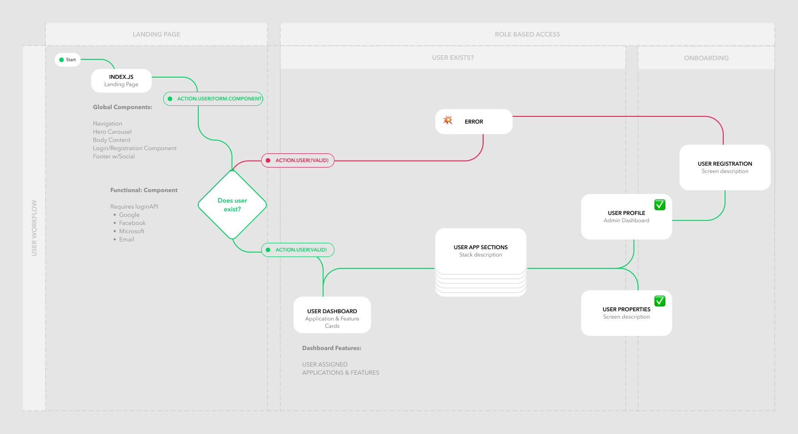

# User Onboarding Case Study 01

- Version 1.0.0
- Last Updated October 25, 2022
- Author: ~M.Dolce
---
This project demonstrates an understanding and ability to execute the following steps:
- Familiarity with client-side JavaScript application development and the React library
- Implementation of a single-page application in React
- Using various React features, including components and forms
- Understanding of the front end of a web application using React and running it on a local development server
- Designing responsive React applications using Reactstrap
- Managing state in a React-Redux application with Redux
- Sending HTTP requests to a server using the Fetch API and dealing with HTTP responses

## Workflow & Planning: What Is This?
In preparation for the upcoming development of a React application using MongoDB with React Native, this project seeks to develop a UI to determine whether a user has an existing login account or not.

### Figma Resource

  

# Research, Resources & Documentation
Thank you to the folks supporting many openly available source codes, tutorials, and applications used as an impetus for the development of this project.
- 

## Server Packages

## npm + Node.js

Be sure to have [Node.js](https://nodejs.org/) installed before proceeding. **We recommend using Node's LTS releases, which is currently at v16.x. We only test our compiled CSS against v16.**

---

## Reference Sites 
